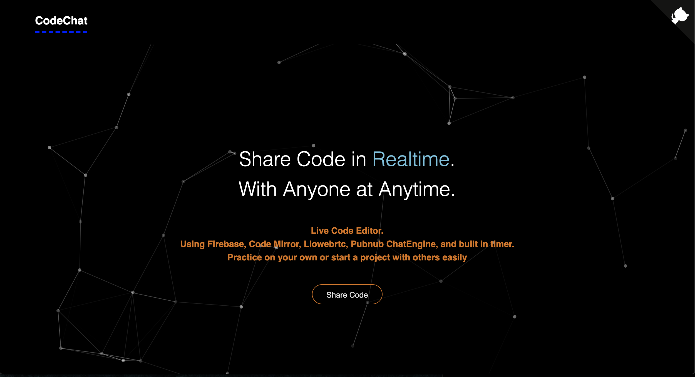
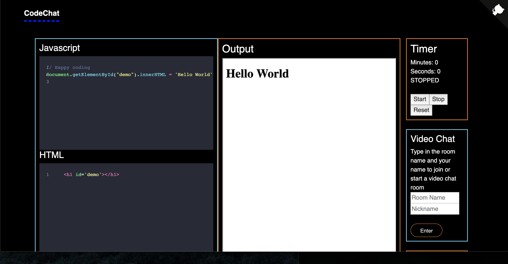
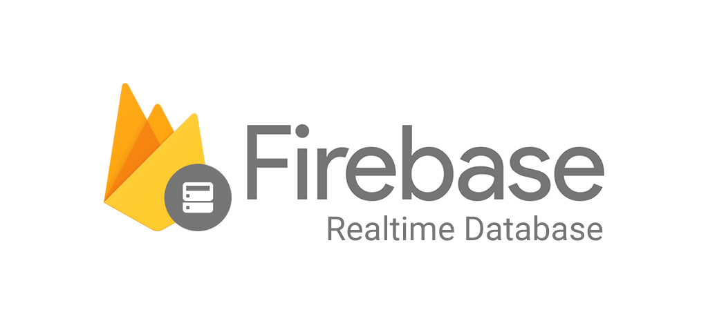

# CodeChat 

This application is a online collaborative live code editor using Liowebrtc, Pubnub ChatEngine, Codemirror, and Firebase. Users can either practice on their own or make web pages with others using this application. This application is useful for users to practice their coding skills, create awesome websites, and test each other to prepare for their career advancement. 


Main Page Above 

# Getting Started 

Site Link: [CodeChat](https://codechat-v1.herokuapp.com/)
(Note: refresh site page if it does not work at first)

After the main page, the user will be taken to the coding page where all of the magic takes place. A brief overview below shows areas for coding(JS, HTML, and CSS), video chat area, a chat area, and a timer. 



Codemirror is used to set up the Javascript, HTML, and CSS portions and the output is a html web page itself. Timer is an npm package that users can reset and test their coding skills against the clock. Video chat is used by utilizing Liowertc for connect between users with both audio and video features. The chat feature is Pubnub ChatEngine in case users want to post a link or suggestions. 

### Prerequisites

Your can access the site from any interest browser including [Google Chrome](https://www.google.com/chrome/), [Firefox](https://www.mozilla.org/en-US/firefox/new/), or [Safari](https://www.apple.com/safari/). 

# Deployment

This site is deployed through [heroku](https://codechat-v1.herokuapp.com/), and uses Firebase Database to store information of the code(HTML, CSS, and Javascript). Firebase is used as a live database to share code edits with each user in the same session. 

# Built With 
* React.js 
* Javascript/JQuery
* Firebase
* Material UI
* Heroku
* Yarn/Npm
  - Particle.js
  - Bootstrap
  - Chat-Engine
  - Codemirror
  - Liowebrtc
  - Random-key
  - Github-corner
  - Compound Timer
  - Copy to Clipboard
  - Pubnub

APIs and Libraries
* [Material-UI](https://material-ui.com/)

    React component that implements Google's Material Design 

* [React-Bootstrap](https://react-bootstrap.github.io/)
  
  Front end framework for react

# Wireframe and Layout

Built with react as the front end and the back end is node.js with Google's live firebase database for live updates. The main design for this project is to make it really easy to navigate the user to using the features like chatting or video chatting, but the focus is on the coding portion so users can easily practice their skills. 

Below includes brief descriptions of each important functions:

# Brief Features Descriptions

## Firebase



After connecting with Firebase with your own keys, the code below sets up a random 5 element key that will be used for each sessions. The key will store the main code the user types,
and as a default each code set already has code input so the user has something to start with instead of starting from scratch. The database contains values for html(content2), javascript(content), css(css), and the data the session was created.

```
state = {
    key: rand.generate(5),
    num: null,
  };
  componentDidMount = () => {
    database()
      .ref("code-sessions")
      .on("value", s => {
        this.setState({ num: s.numChildren() });
      });
  };

  onNewGround = () => {
    database()
      .ref("code-sessions/" + this.state.key)
      .set({
        content: `// Happy coding
document.getElementById("demo").innerHTML = 5 + 6;  
        `,
        content2: "<h1 id='demo'></h1>",
        css: "css area",
        createdon: Date()
      });
    this.props.history.push("/" + this.state.key);

  };
```

## Codemirror


Codemirror is really useful to make a code editor online for multiple users. Firebase takes the values from each of the code area and updates the database to share with other users in realtime. 

```
onChange = (newVal, change) => {
    this.setState(
      {
        cursorPosition: {
          line: this.codemirror.getCodeMirror().doc.getCursor().line,
          ch: this.codemirror.getCodeMirror().doc.getCursor().ch
        }
      },
      () => {}
    );
    this.codeRef.child("content").set(newVal);
  };
```
The code above takes any changes the user makes from cursorPosition and sets it to the value of the variable that will be sent to the database. There are three of these for each code area. 

The output area is performed with the runcode function below:
```
runCode = () => {
  const { code, code1, code2 } = this.state;

  const iframe = this.refs.iframe;
  const document = iframe.contentDocument;
  const documentContents = `
    <!DOCTYPE html>
    <html lang="en">
    <head>
      <meta charset="UTF-8">
      <meta name="viewport" content="width=device-width, initial-scale=1.0">
      <meta http-equiv="X-UA-Compatible" content="ie=edge">
      <title>Document</title>

      <style>
    ${code2}
    </style>
    </head>
    <body>
      ${code1}

      <script type="text/javascript">
        ${code}
      </script>
    </body>
    </html>
  `;

  document.open();
  document.write(documentContents);
  document.close();
};
```
The output area is a web page itself set up so that the changes the user makes in the code area will be shown in this web page with html,css, and javascript positioned like in any normal web page. A document will be open and include the user's code as documentContents and closed after the changes are done. 

## LioWebrtc

An event-based WebRTC library that makes it easy to embed real-time peer to peer communication into UI components.
```
<Party
    roomName={`liowebrtc-vchat-demo-${this.state.roomName}`}
    nick={this.state.nick}
    windowColor={this.state.windowColor}
    iOS={this.state.iOS}
    handleStartVideo={this.handleStartVideo}
/>
```
The video chat features takes the roomName the user types and open audio and video from the user's computer. 

```
join = (webrtc) => webrtc.joinRoom(this.state.roomID, (err, desc) => {
    this.setState({ inRoom: true });
  });
generateRemotes = () => this.state.peers.map((peer) => (
      <RemoteVideo key={`remote-video-${peer.id}`} peer={peer} id=""/>
    )
  );
```
The join and generateRemotes function connects other users with the current video chat and sets them to the room. 

## Pubnub ChatEngine


```
componentDidMount() {
    this.pubnub.subscribe({
        channels: [chatKey],
        withPresence: true
    });

    this.pubnub.getMessage(chatKey, (msg) => {
          this.pubnub.hereNow(
            {
                channels: [chatKey],
                includeUUIDs: true,
                includeState: true
            },
            (status, response) => {
                console.log(status);
                console.log(response);
            }
        );
        const {text, uuid} = msg.message
        let messages = this.state.messages;
        messages.push(
          <Message key={ this.state.messages.length } uuid={ uuid } text={ text }/>
        );
        this.setState({
            messages: messages
        });
    });
  }
```
The chat code above is used to connect new users to the current channel. Every time a new message is typed, the message is added to an array and display on the chat area. 

# Final Thoughts
Hope everyone enjoys this application, I had a really great time creating the project and I hope everyone will enjoy it too.

Thank you

# Author
* **Muhammad** - https://github.com/mawais54013
